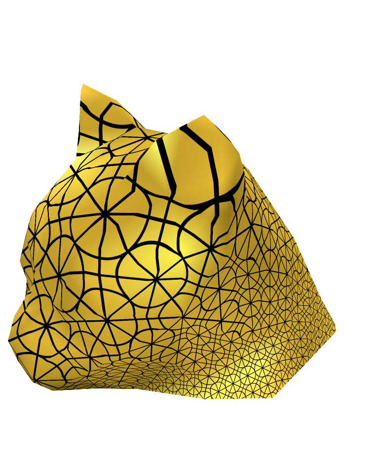
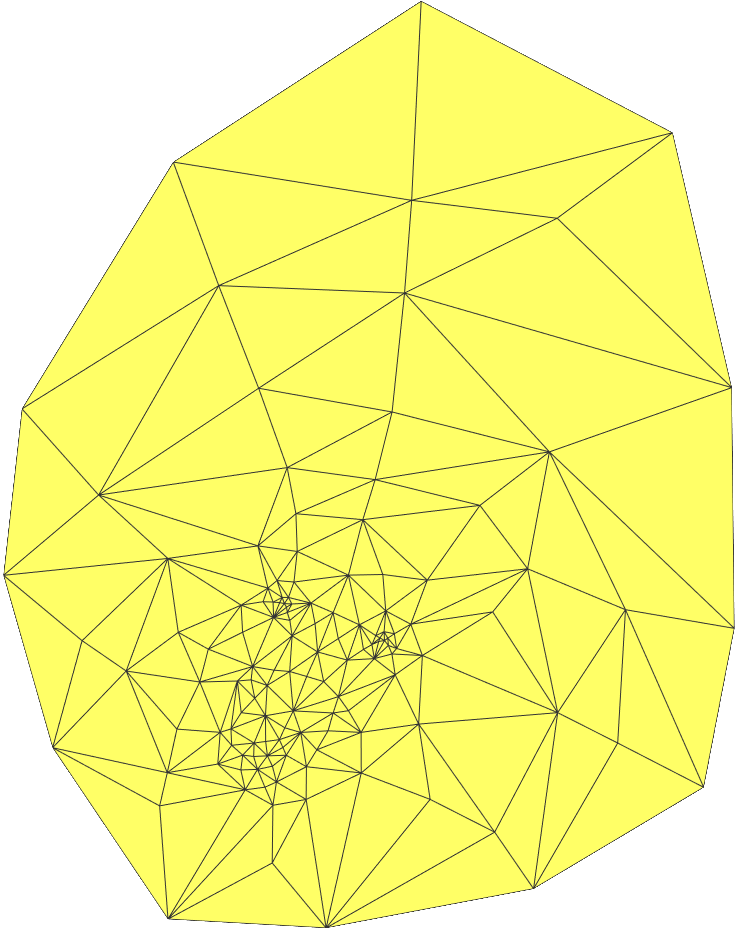
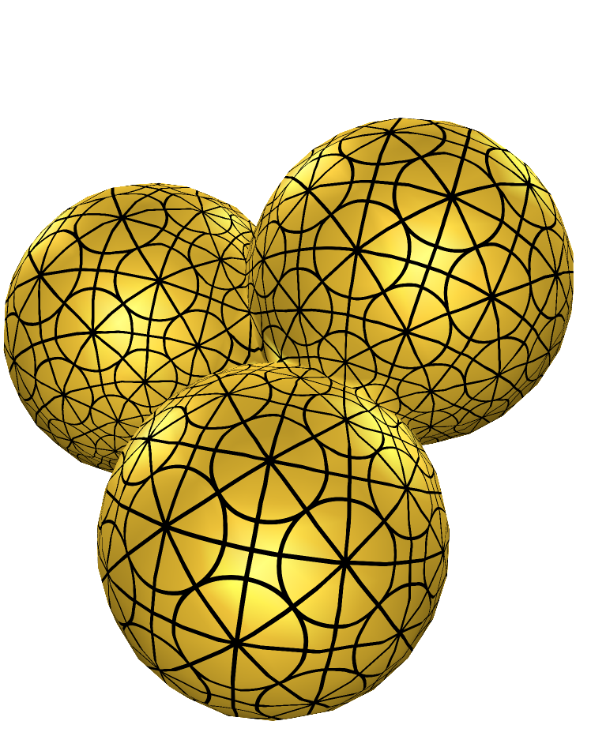
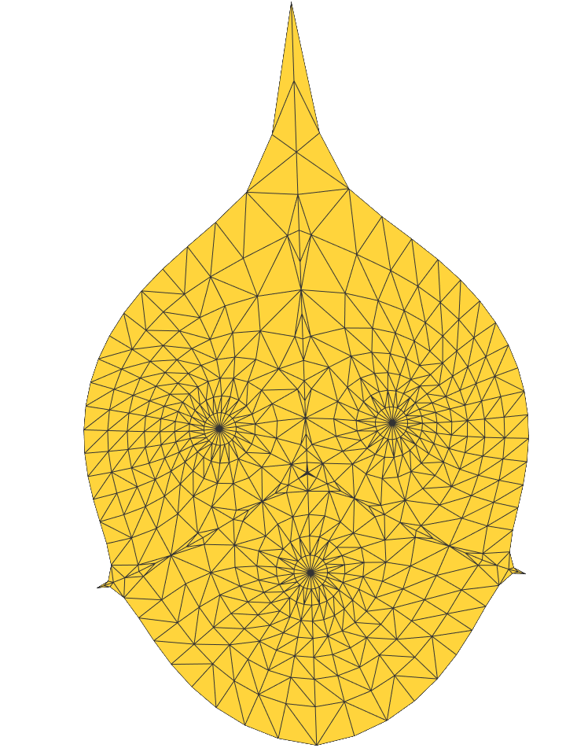
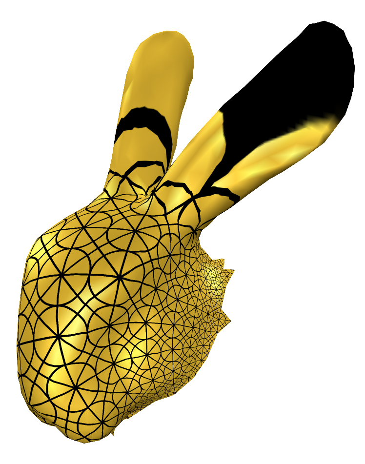
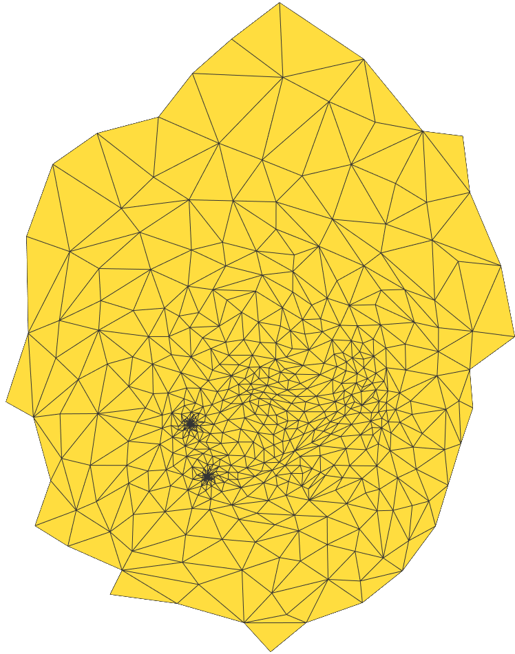
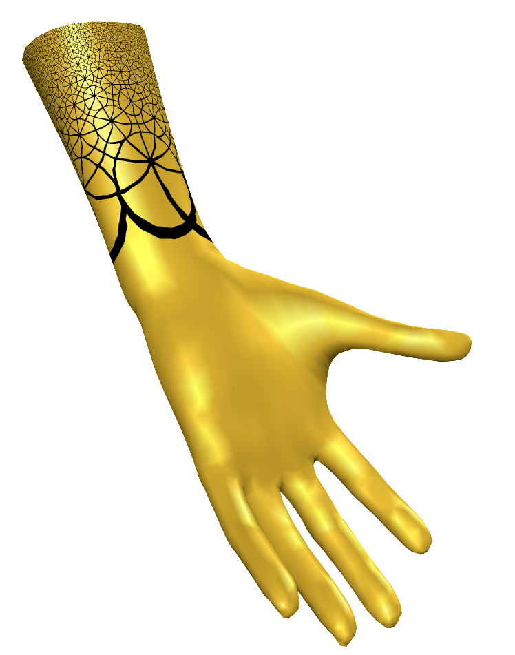
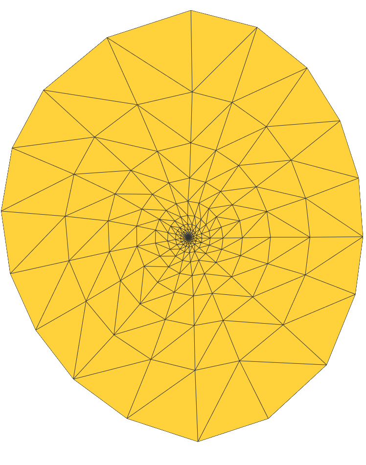
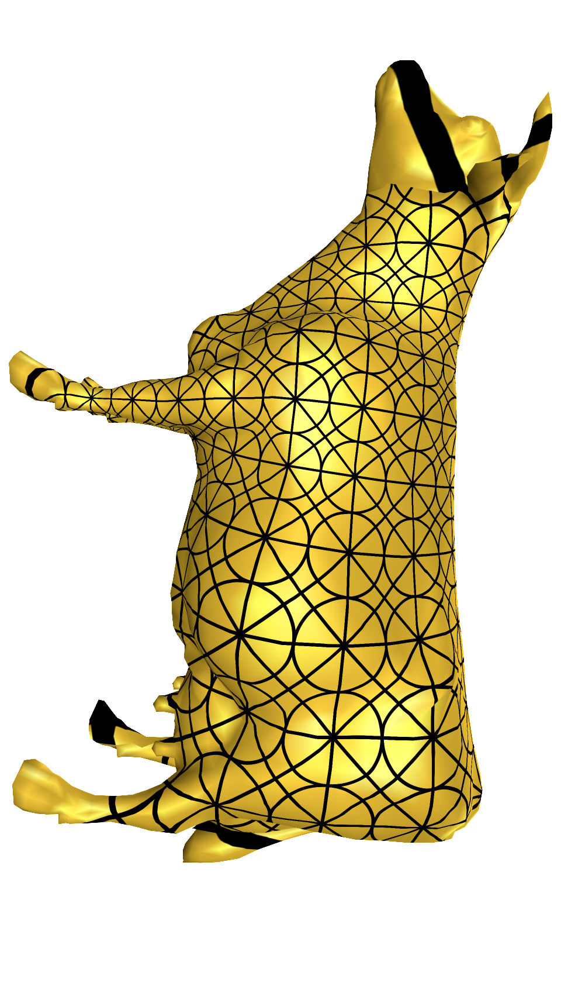
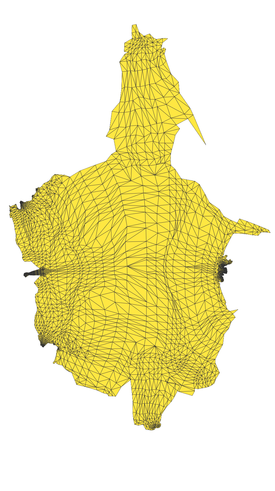

# Introduction
Fork from GAMES301(https://ustc-gcl-f.github.io/code/index.html#sec_surface_framework)

Simplified CMakeLists.txt to use vcpkg to manage 3dparty for automatly building projects.


## GAMES 301 Homework

### Homework 3 : Discrete one-forms on meshes and applications to 3D mesh parameterization (Sec. 4, Free-Boundary Linear Parameterization of 3D Meshes in the Presence of Constraints)

Prerequisites:
+ Tutte's Embedding structure
+ Least Square Method

Target:
1. [**DONE**] Least Square Conformal Maps
2. [**DONE**] Tutte's Embedding with Mean-value Weights

Usage:
 
```bash
git checkout hw3_FreeBoundary
./build_windows.bat
```
then run the subproject `SurfaceFrameworkCmake`.

Note

+ Relevant codes please refer to `Surface_Framework_Cmake/src/homeworks/FreeBoundary`.
+ For free-boundary planar parameterization, click `Tool->Free Boundary Param->Free Boundary Solver` and wait. The 2D parameterzation results will be generated after solver terminating. Then you could switch to `Embedding` mode for parameterization results.
+ Users could switch to the model that rendering UV texture mapping by checking the the checkbox `Draw Mesh UV` in the left panel. The UV mapping works under `Smooth Rendering` mode and `Embedding` mode.
+ If you want to visualize the 2D parameterization results, click the `Embedding` button in the toolbar.
+ If you want to change the uv mapping texture, please refer the `QGLViewerWidget::LoadTexture()` in line 479 in `QGLViewerWidget.cpp`.
+ If you want to change the density of UV mapping, please scroll the slider in the left panel.
+ If you've got good ideas, raise Issue and create Pull requests please.

Parameterization results

| Name | Format | Face Type | V | E | F | Boundaries | Storage |
| :-: | :-: | :-: | :-: | :-: | :-: | :-: | :-: |
|   cathead | OBJ | triangle |  131 |  378 |  248 | 1 |   8 KB |
|     Balls | OBJ | triangle |  547 | 1578 | 1032 | 1 |  26 KB |
| bunnyhead | OBJ | triangle |  741 | 2188 | 1448 | 1 |  54 KB |
|      hand | OFF | triangle | 1558 | 4653 | 3096 | 1 |  97 KB |
|       cow | OBJ | triangle | 3195 | 8998 | 5804 | 1 | 194 KB |

Performance Data

| Name | V | F | LSCM (ms) | Tutte's Embedding (ms) | Total (ms) |
| :-: | :-: | :-: | :-: | :-: | :-: |
|   cathead |  131 |  248 |   0.606 |  0.457 |   1.596 |
|     Balls |  547 | 1032 |   6.714 |  1.838 |   9.452 |
| bunnyhead |  741 | 1448 |   9.454 |  2.537 |  13.277 |
|      hand | 1558 | 3096 |  24.617 |  6.039 |  33.280 |
|       cow | 3195 | 5804 | 320.225 | 15.599 | 344.261 |

> If you want to run the free-boundary method with models whose vertices number is too large, be careful, it will be time-consuming.

### Gallery

+ cathead : LSCM + Mean-value Weight

+ cathead : planar parameterization



+ Balls : LSCM + Mean-value Weight

+ Balls : planar parameterization



+ bunnyhead : LSCM + Mean-value Weight

+ bunnyhead : planar parameterization



+ hand : LSCM + Mean-value Weight

+ hand : planar parameterization



+ cow : LSCM + Mean-value Weight

+ cow : planar parameterization


> Refer to `./pics` for more results. 
