# Introduction
Fork from GAMES301(https://ustc-gcl-f.github.io/code/index.html#sec_surface_framework)

Simplified CMakeLists.txt to use vcpkg to manage 3dparty for automatly building projects.


## GAMES 301 Homework

### Homework 4 : Boundary First Flattening

Prerequisites:
+ Conformal Maps
+ cotan-Laplacian Matrix

Target:
1. [**DONE**] Conformal Maps
2. [**DONE**] Free-Boundary Flattening
3. [**DONE**] Uniform-Disk Flattening
4. [**DONE**] Fixed-Boundary Flattening

Usage:
 
```bash
git checkout hw4_BoundaryFirstFlattening
./build_windows.bat
```
then run the subproject `SurfaceFrameworkCmake`.

Note

+ Relevant codes please refer to `Surface_Framework_Cmake/src/homeworks/BoundaryFirstFlattening`.
+ For free-boundary planar parameterization, click `Tool->Free Boundary Param->Free Boundary Solver` and wait. The 2D parameterzation results will be generated after solver terminating. Then you could switch to `Embedding` mode for parameterization results.
+ Users could switch to the model that rendering UV texture mapping by checking the the checkbox `Draw Mesh UV` in the left panel. The UV mapping works under `Smooth Rendering` mode and `Embedding` mode.
+ If you want to visualize the 2D parameterization results, click the `Embedding` button in the toolbar.
+ If you want to change the uv mapping texture, please refer to the `QGLViewerWidget::LoadTexture()` in line 479 in `QGLViewerWidget.cpp`.
+ If you want to change the fixed-boundary mapping, please refer to the `MeshViewerWidget::BFFSolver()` in `MeshViewerWidget.cpp`.
+ If you want to change the density of UV mapping, please scroll the slider in the left panel.
+ If you've got good ideas, raise Issue and create Pull requests please.

Parameterization results

| Name | Format | Face Type | V | E | F | Boundaries | Storage |
| :-: | :-: | :-: | :-: | :-: | :-: | :-: | :-: |
|   cathead | OBJ | triangle |  131 |  378 |  248 | 1 |   8 KB |
|     Balls | OBJ | triangle |  547 | 1578 | 1032 | 1 |  26 KB |
| bunnyhead | OBJ | triangle |  741 | 2188 | 1448 | 1 |  54 KB |
|      hand | OFF | triangle | 1558 | 4653 | 3096 | 1 |  97 KB |
|       cow | OBJ | triangle | 3195 | 8998 | 5804 | 1 | 194 KB |
|      face | OBJ | triangle |17157 |51300 |34140 | 1 |1.13 MB |

Performance Data

| Name | V | F  | Total (ms) |
| :-: | :-: | :-: | :-: |
|   cathead |   131 |    248 |   0.878 |
|     Balls |   547 |   1032 |   2.553 |
| bunnyhead |   741 |   1448 |   3.479 |
|      hand |  1558 |   3096 |   8.199 |
|       cow |  3195 |   5804 | 110.963 |
|      face |  3195 |   5804 | 113.171 |
|   hilbert | 79129 | 147168 |   13min |

> If you want to run the free-boundary method with models whose vertices number is too large, be careful, it will be time-consuming.

### Gallery

+ cathead : BFF free-boundary flattening
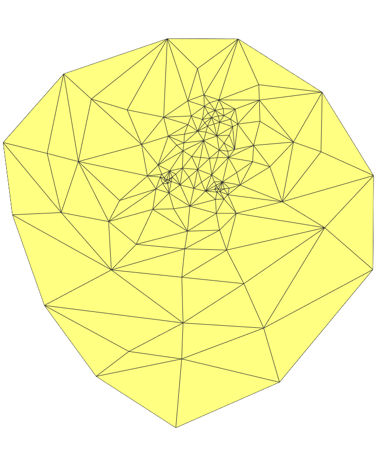
+ cathead : BFF flattening result
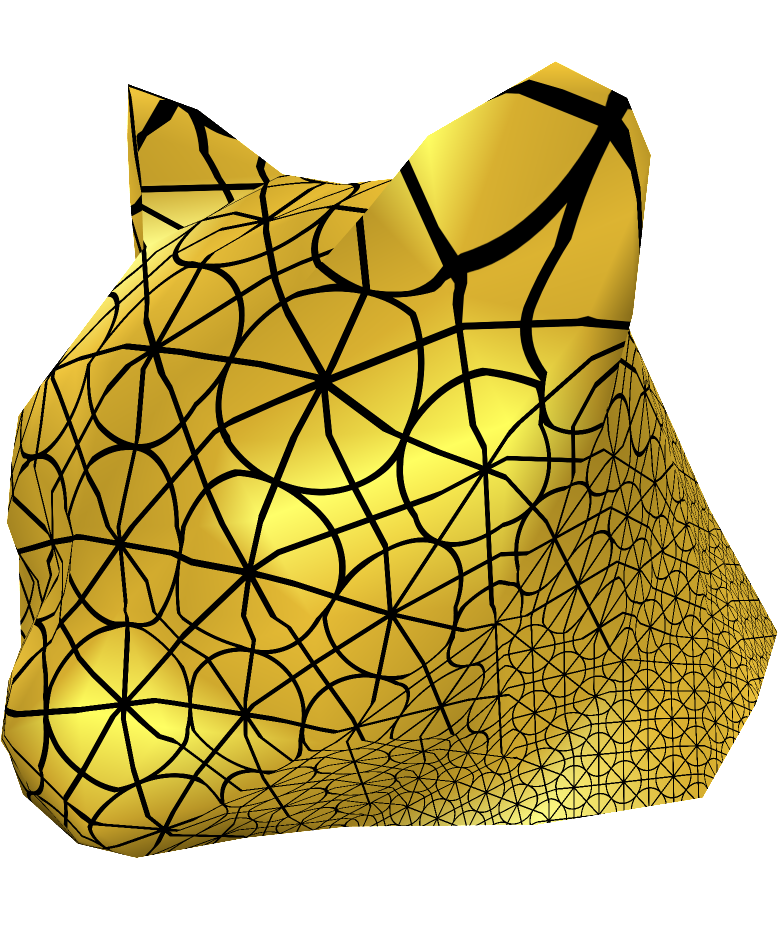

+ Balls : BFF free-boundary flattening
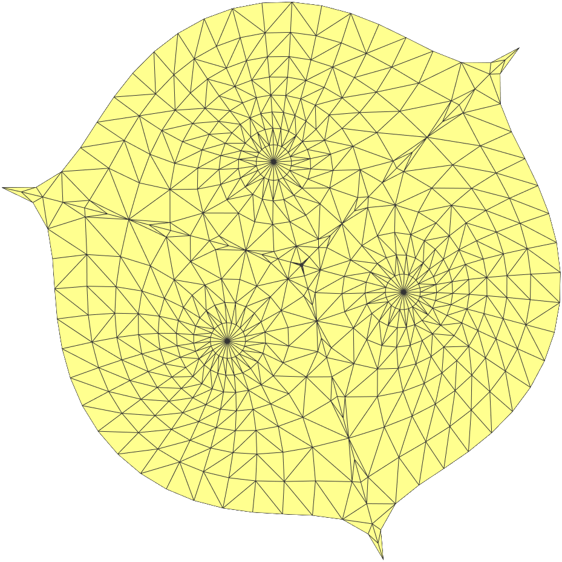
+ Balls : BFF flattening result
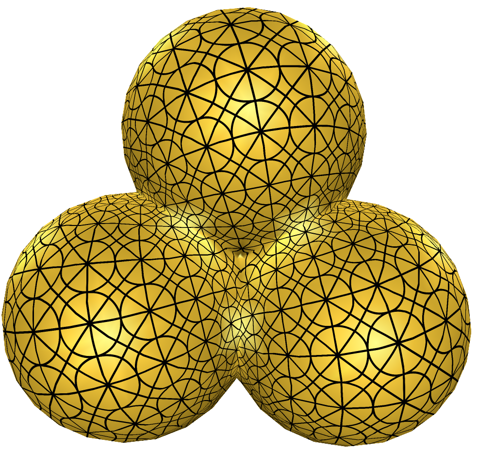


+ bunnyhead : BFF free-boundary flattening
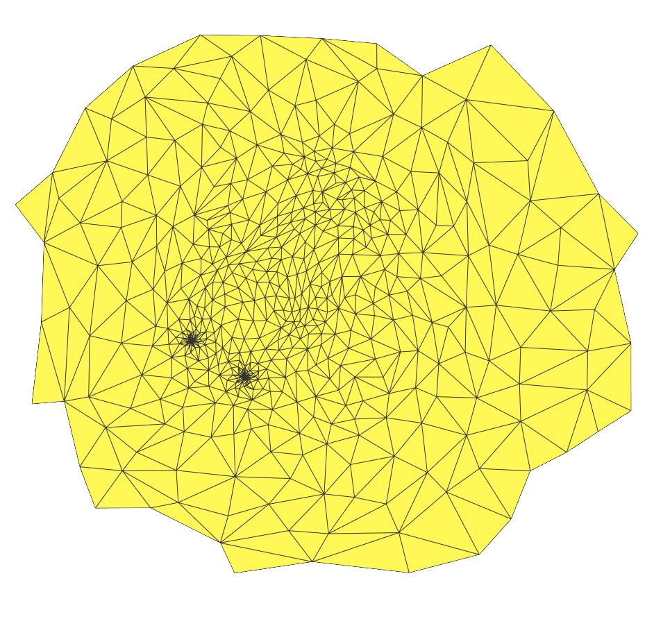
+ bunnyhead : BFF flattening result
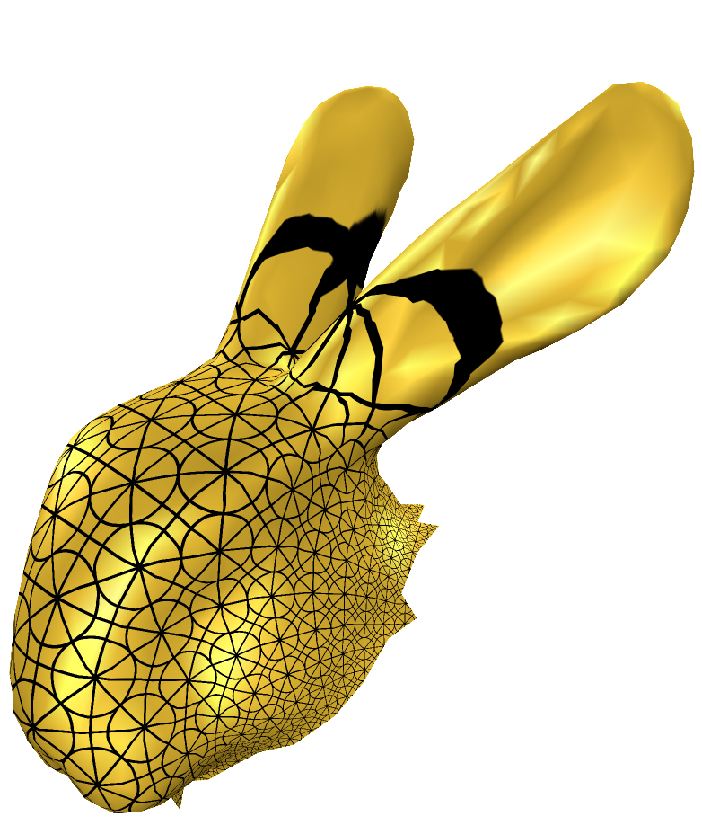

+ hand : BFF free-boundary flattening
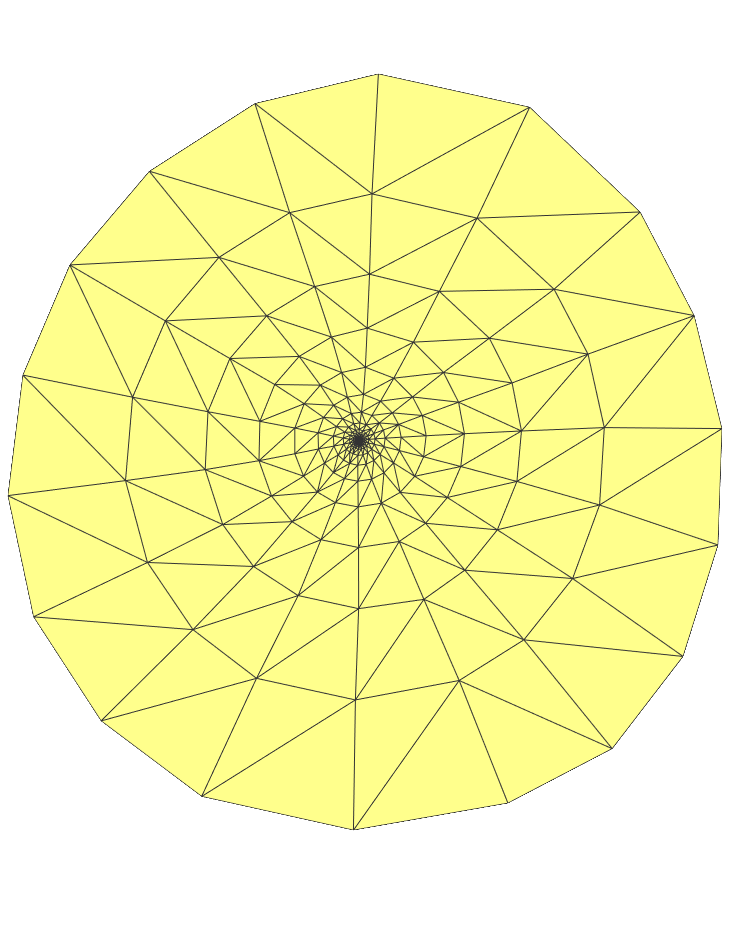
+ hand : BFF flattening result
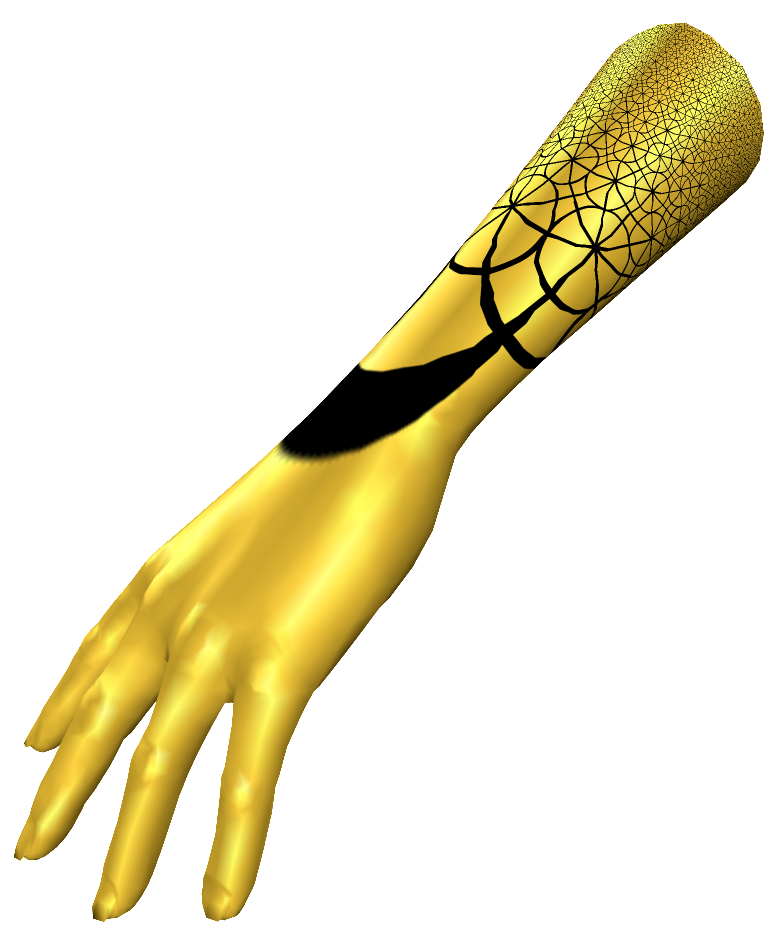

+ cow : BFF free-boundary flattening
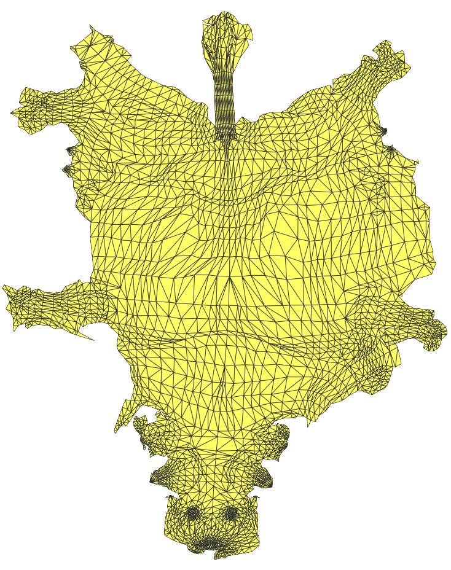
+ cow : BFF flattening result
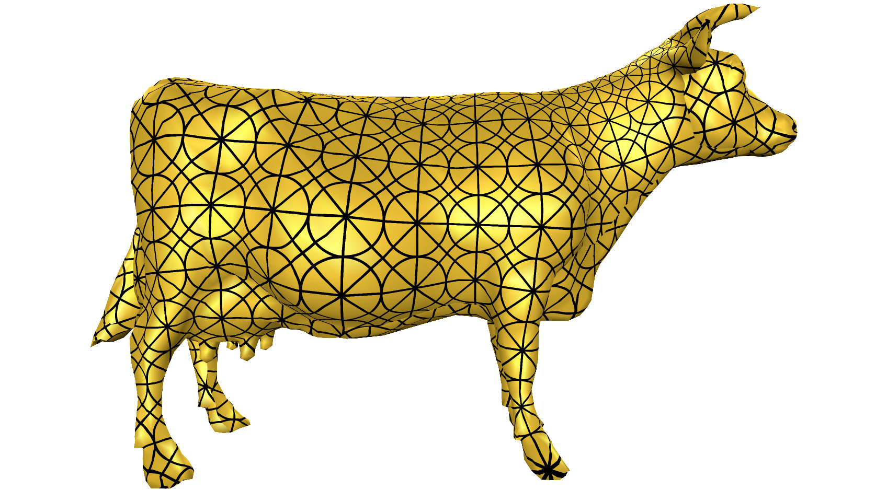

+ face : BFF free-boundary flattening
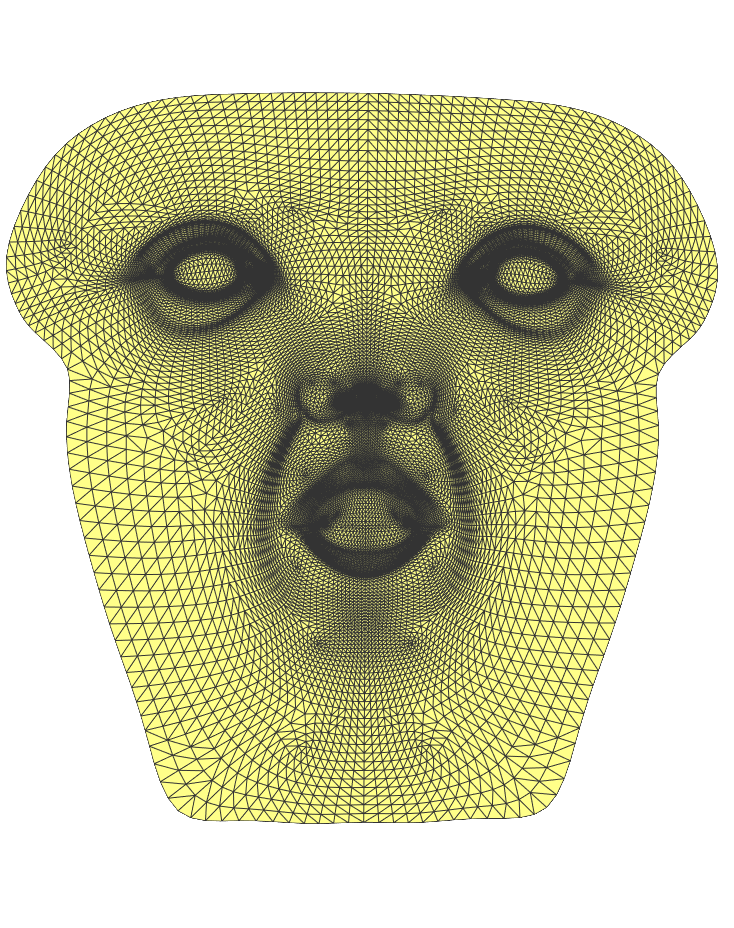
+ face : BFF flattening result
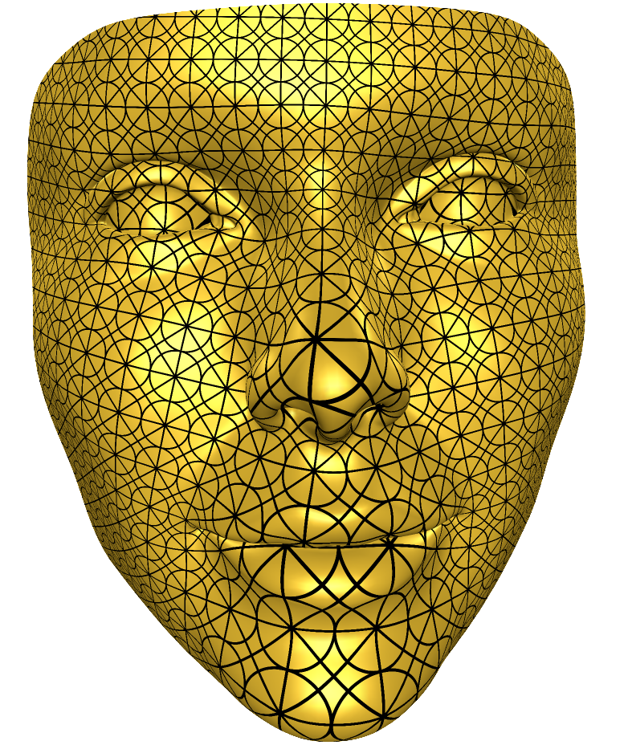

> Refer to `./pics` for more results. 
