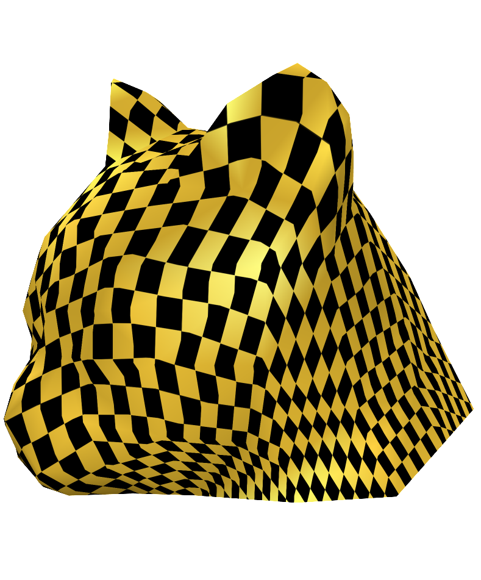
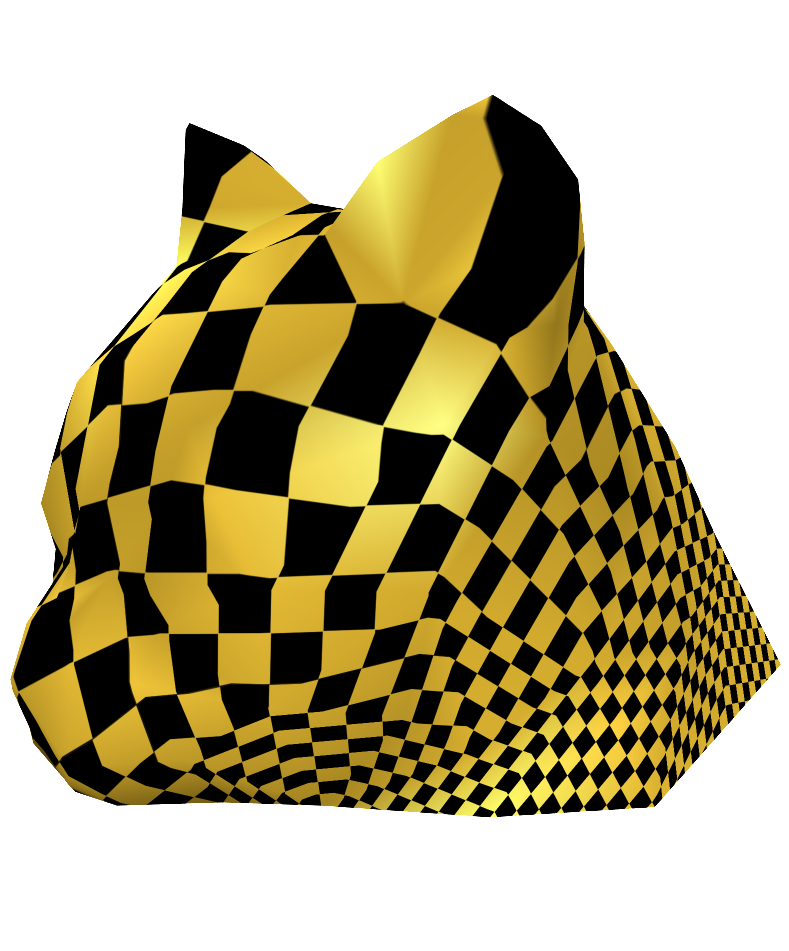
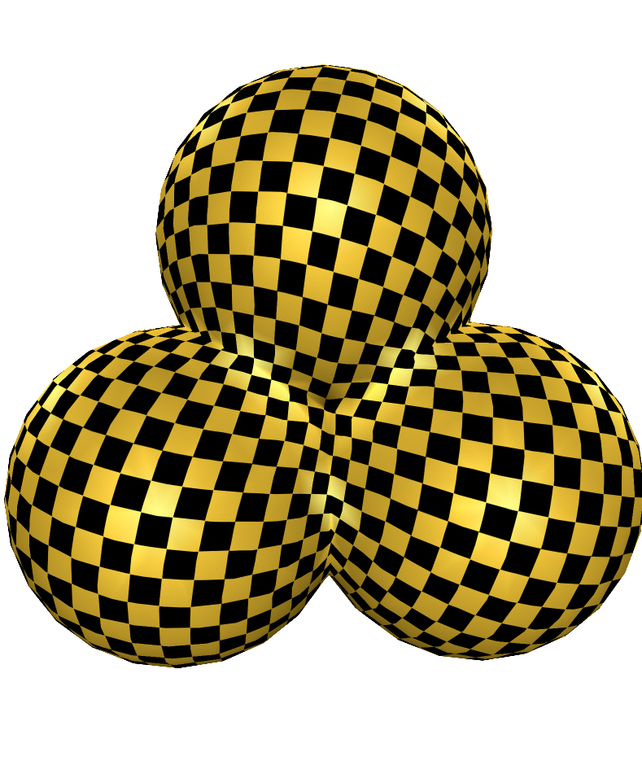
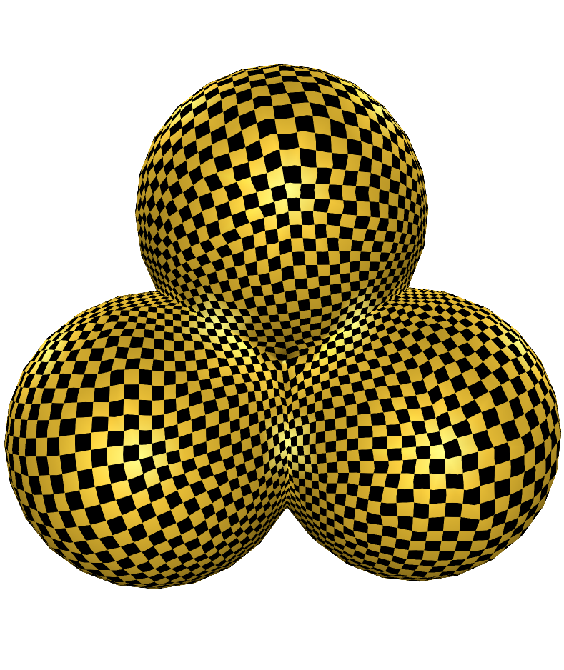
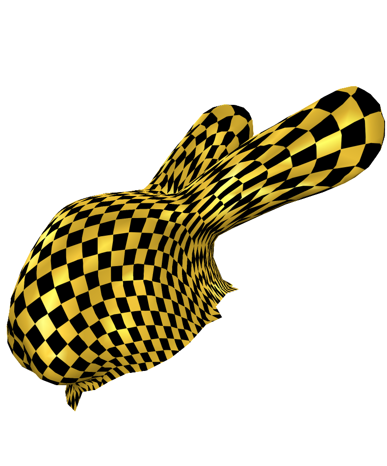
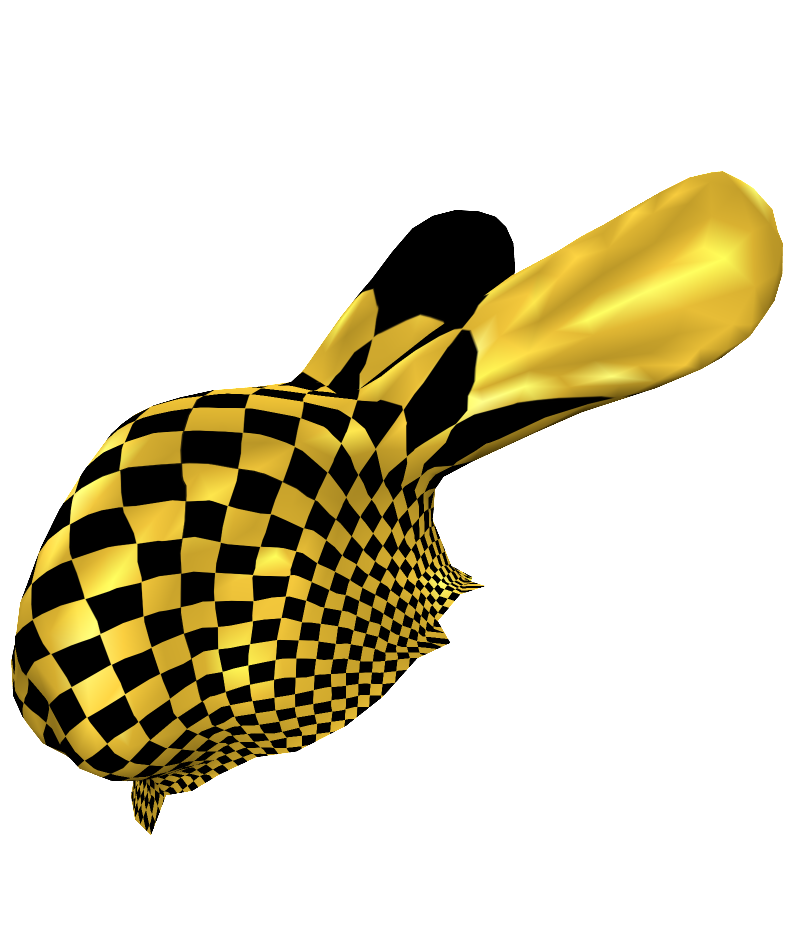
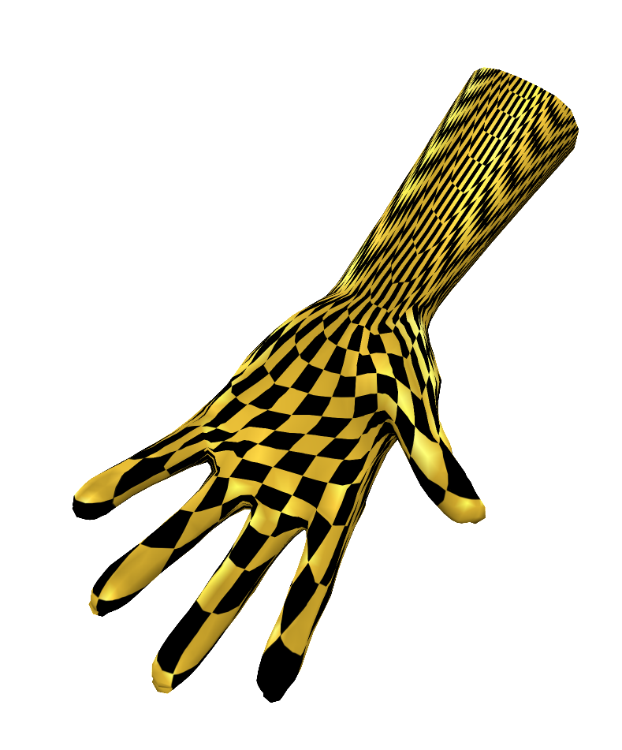
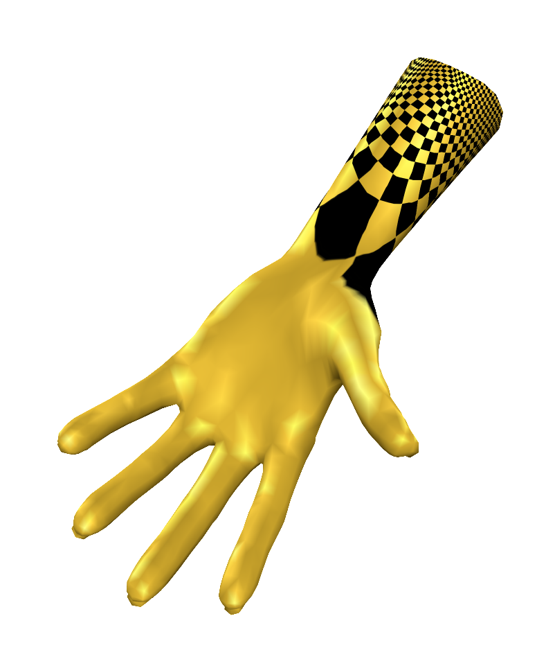

# Introduction
Fork from GAMES301(https://ustc-gcl-f.github.io/code/index.html#sec_surface_framework)

Simplified CMakeLists.txt to use vcpkg to manage 3dparty for automatly building projects.


## GAMES 301 Homework

### Homework 3 : Discrete one-forms on meshes and applications to 3D mesh parameterization (Sec. 4, Free-Boundary Linear Parameterization of 3D Meshes in the Presence of Constraints)

Prerequisites:
+ Tutte's Embedding structure
+ Least Square Method

Target:
1. [**TODO**] Basic structure

Usage:
 
```bash
git checkout hw3_FreeBoundary
./build_windows.bat
```
then run the subproject `SurfaceFrameworkCmake`.

Note

+ Relevant codes please refer to `Surface_Framework_Cmake/src/homeworks/FreeBoundary`:
+ I've add tabs of Tutte's weight and Floater Weight, but the UV mapping is only visible under `smooth rendering` mode.
+ If you want to visualize the 2D parameterization results, uncomment the line 468 in `MeshViewerWidget.cpp`.
+ If you want to change the 2D parameterization boundary shape, please refer to line 416 to line 420 in `MeshViewerWidget.cpp`.
+ If you want to add customized boundary shape, please add enums of `enum class UVBoundaryType` in line 8 in `Util_TutteEmbedding.h`, and implement the corresponding codes calculating UV in switch-case branch in line 17 in `Util_TutteEmbedding.cpp`.
+ If you want to change the uv mapping texture, please refer the `QGLViewerWidget::LoadTexture()` in line 474 in `QGLViewerWidget.cpp`.
+ If you want to change the density of UV mapping, please modify the tiling factor `uvScale` of line 317 in `MeshViewerWidget.cpp`.
+ If you've got good ideas, raise Issue and create Pull requests please.

Parameterization results

| Name | Format | Face Type | V | E | F | Boundaries | Storage |
| :-: | :-: | :-: | :-: | :-: | :-: | :-: | :-: |
<!-- |   cathead | OBJ | triangle |  131 |  378 |  248 | 1 |  8 KB |
|     Balls | OBJ | triangle |  547 | 1578 | 1032 | 1 | 26 KB |
| bunnyhead | OBJ | triangle |  741 | 2188 | 1448 | 1 | 54 KB |
|      hand | OFF | triangle | 1558 | 4653 | 3096 | 1 | 97 KB | -->


### Gallery
Under Construction....
<!-- 
+ cathead : Project Newton Method

+ cathead : Floater's weight



+ Balls : Project Newton Method

+ Balls : Floater's weight


+ bunnyhead : Project Newton Method

+ bunnyhead : Floater's weight


+ hand : Project Newton Method

+ hand : Floater's weight
 -->

<!-- > Refer to `./pics` for more results.  -->
