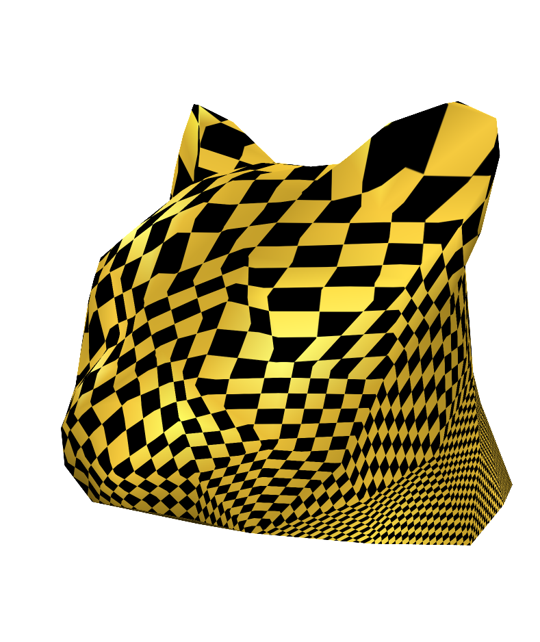
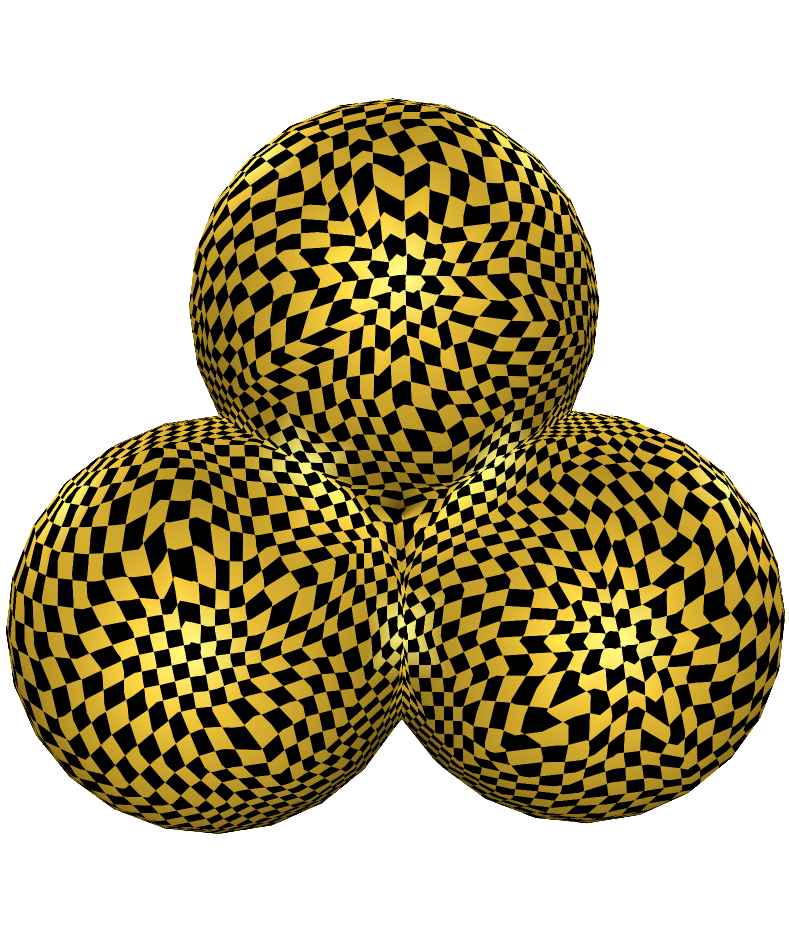

# Introduction
Fork from GAMES301(https://ustc-gcl-f.github.io/code/index.html#sec_surface_framework)

Simplified CMakeLists.txt to use vcpkg to manage 3dparty for automatly building projects.


## GAMES 301 Homework

### Homework 1 : Tutte's Embedding (Planar Parameterization)

Target:
1. [**Done**] Implement the basic structure of the Tutte's Embedding method.
2. [**Done**] Calculate the weight of lambda with Tutte's (uniform) and Floater's (shape-preserving) respectively.
3. [**Done**] Visualize the UV mapping.

Usage:
 
```bash
git checkout hw1_TutteEmbedding
./build_windows.bat
```
then run the subproject `SurfaceFrameworkCmake`.

Note

+ I've add tabs of Tutte's weight and Floater Weight, but the UV mapping is only visible under `smooth rendering` mode.
+ If you want to visualize the 2D parameterization results, uncomment the line 683 in `MeshViewerWidget.cpp`.
+ If you want to change the 2D parameterization boundary shape, please refer to line 631 to line 635 in `MeshViewerWidget.cpp`.
+ If you want to add customized boundary shape, please add enums in `enum class UVBoundaryType` in line 376, and implement the corresponding codes calculating UV in switch-case branch in line 393 in `MeshViewerWidget.cpp`.
+ If you want to change the density of UV mapping, please modify the tiling factor of line 315 in `MeshViewerWidget.cpp`.
+ If you've got good ideas, raise Issue and create Pull requests please.

Parameterization results

| Name | Format | Face Type | V | E | F | Boundaries | Storage |
| :-: | :-: | :-: | :-: | :-: | :-: | :-: | :-: |
| cathead | OBJ | triangle |  131 |  378 |  248 | 1 |  8 KB |
|   Balls | OBJ | triangle |  547 | 1578 | 1032 | 1 | 26 KB |
|    hand | OFF | triangle | 1558 | 4653 | 3096 | 1 | 97 KB |

### Gallery

+ cathead : Tutte's weight

+ cathead : Floater's weight


+ Balls : Tutte's weight

+ Balls : Floater's weight


+ hand : Tutte's weight

+ hand : Floater's weight


> Refer to `./pics` for more results. 